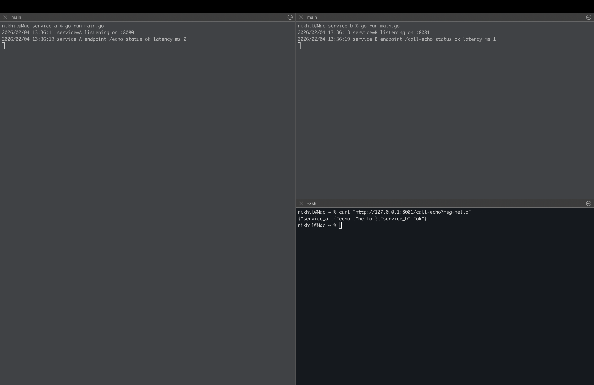
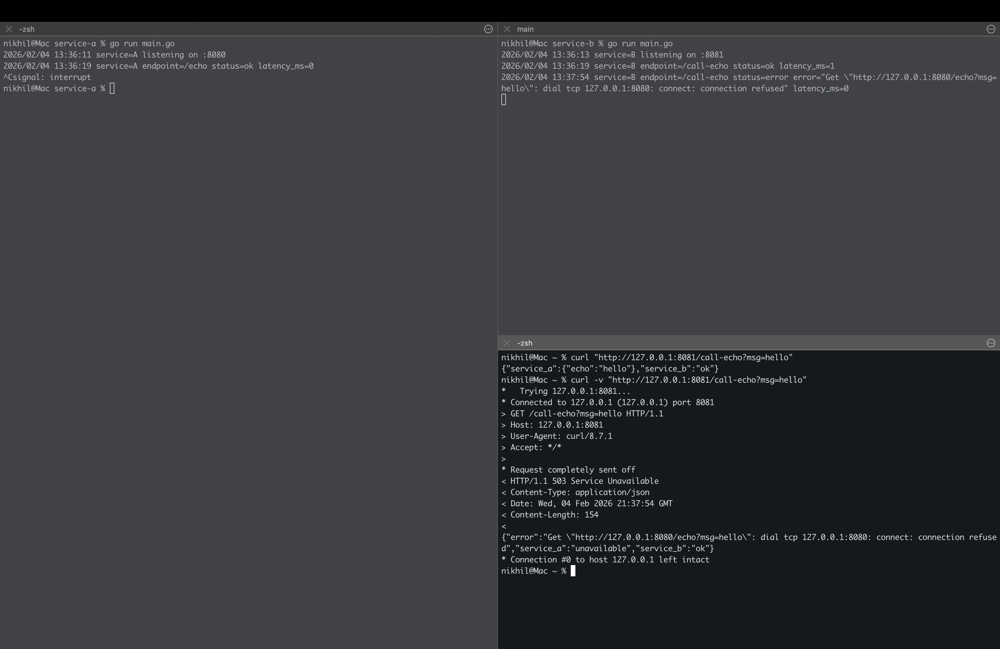

# CMPE 273 Lab 1: Distributed Echo System


This project is a tiny distributed system consisting of two independent services (Service A and Service B) that communicate over HTTP.


## How to Run Locally


**Prerequisites:** Go 1.21+


### 1. Start Service A (Echo Server)


This service listens on port `8080` and echoes back any message it receives.


```bash

cd go-http

go run service-a/main.go

# Output: service=A listening on :8080

```


### 2. Start Service B (Client)


Open a new terminal. This service listens on port `8081`, acts as a proxy to Service A, and handles failures.


```bash

cd go-http

go run service-b/main.go

# Output: service=B listening on :8081

```


### 3. Test the System


Open a third terminal and use curl to send a request to Service B.


```bash

curl "http://127.0.0.1:8081/call-echo?msg=hello"

```


## Success & Failure Proof


### Success Case


When both services are running, Service B successfully calls Service A and returns a combined JSON response.


**Command:**


```bash

curl "http://127.0.0.1:8081/call-echo?msg=hello"

```


**Output:**


```json

{

  "service_a": {

    "echo": "hello"

  },

  "service_b": "ok"

}

```




### Failure Case


When Service A is stopped (via `Ctrl+C`), Service B detects the failure (connection refused), logs the error, and returns a `503 Service Unavailable` status instead of crashing.


**Command:**


```bash

curl -v "http://127.0.0.1:8081/call-echo?msg=hello"

```


**Output:**


```
* Trying 127.0.0.1:8081...
* Connected to 127.0.0.1 (127.0.0.1) port 8081
> GET /call-echo?msg=hello HTTP/1.1
> Host: 127.0.0.1:8081
> User-Agent: curl/8.7.1
> Accept: */*
>
* Request completely sent off
< HTTP/1.1 503 Service Unavailable
< Content-Type: application/json
< Date: Wed, 04 Feb 2026 21:15:47 GMT
< Content-Length: 154
<
{"error":"Get \"[http://127.0.0.1:8080/echo?msg=hello](http://127.0.0.1:8080/echo?msg=hello)\": dial tcp 127.0.0.1:8080: connect: connection refused","service_a":"unavailable","service_b":"ok"}
* Connection #0 to host 127.0.0.1 left intact

```


```json

{

  "error":"Get \"http://127.0.0.1:8080/echo?msg=hello\": dial tcp 127.0.0.1:8080: connect: connection refused",
  "service_a":"unavailable",
  "service_b":"ok"

}

```



## What Makes This Distributed?


This system is distributed because it consists of two distinct processes (Service A and Service B) running in separate memory spaces. They do not share variables or state directly; instead, they communicate strictly over a network protocol (HTTP). This architecture allows them to fail independently: if Service A crashes, Service B remains operational and can gracefully handle the outage by returning a 503 error rather than crashing the entire application.
